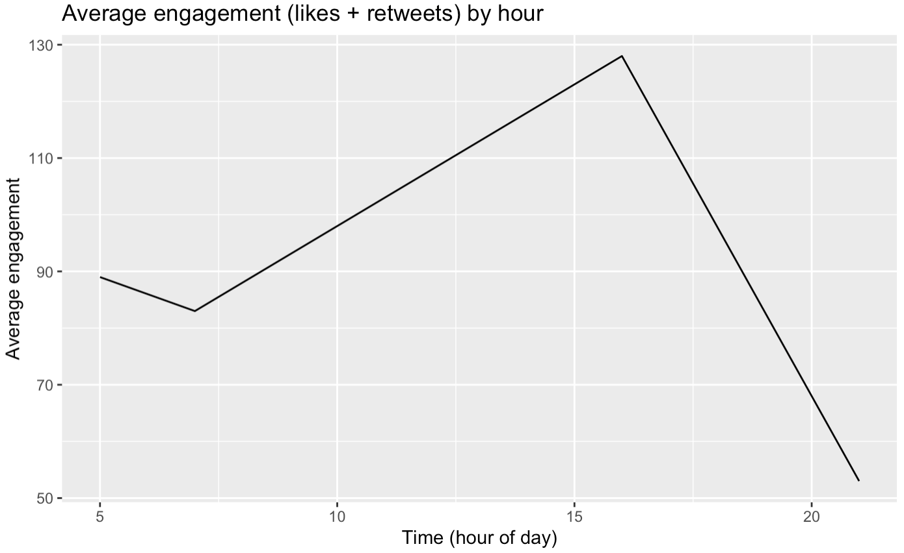

<!-- badges: start -->

[](https://github.com/UBC-MDS/rtweetclean/actions)
[](https://codecov.io/gh/UBC-MDS/rtweetclean)
<!-- badges: end -->

# rtweetclean

rtweetclean is a R package built to act as a processor of data generated
by the existing [rtweet
package](https://www.rdocumentation.org/packages/rtweet/versions/0.4.0)
that can produce clean data frames, summarize data, and generate new
features.

Our package aims to add additional resources for users of the already
existing rtweet package. rtweet is a package built around Twitter’s API
and is used to scrape tweet information from their servers. Our package
creates functionality which enables users to process the raw data from
rtweet into a more understandable format by extracting and organizing
the contents of tweets for a user. rtweet is specifically built to be
used in analysis of a specific user’s timeline (generated using tweepy’s
api.user\_timeline function). Users can easily visualize average
engagement based on time of day posted, see basic summary statistics of
word contents and sentiment analysis of tweets and have a processed
dataset that can be used in a wide variety of machine learning models.

## Installation

You can install the development version from
[GitHub](https://github.com/) with:

``` r
# install.packages("devtools")
devtools::install_github("UBC-MDS/rtweetclean")
```

## Functions

-   `clean_df(raw_tweets_df, handle = "", text_only = TRUE, word_count = TRUE, emojis = TRUE, hashtags = TRUE, sentiment = TRUE, flesch_readability = TRUE, proportion_of_avg_retweets = TRUE, proportion_of_avg_favorites = TRUE)`:
    Cleans up and creates new feature columns to the dataframe obtained
    by using the tweepy package, including: a link/hashtag/emoji free
    version of the text column, a wordcount, a sentimentality score, a
    flesch readability score, a user entered handle, a column containing
    all emojis used, and a column containing all hashtags used.

-   `tweet_words(clean_tweets_df)`: Generates a list of the most
    frequently used words by the twitter user. Uses the dataframe
    created by the `clean_df()` function as an input.

-   `sentiment_total(clean_tweets_df)`: Returns a summary count of the
    number of words that are associated with a list of
    emotions/sentiments. Uses the `text_only` column of the dataframe
    created by the `clean_df()` function as an input.

-   `engagement_by_hour(clean_tweets_df)`: Plots a line chart showing
    popular times of the day to tweet for the user, by displaying
    average engagement (favorites + retweets) received by hour of day.
    Uses the dataframe created by the `clean_df()` function as an input.

## Dependencies

|     **R Package**      |
|:----------------------:|
|  magrittr &gt;= 2.0.1  |
|   dplyr &gt;= 1.0.4    |
| lubridate &gt;= 1.7.10 |
|  ggplot2 &gt;= 3.3.3   |
|   tidyr &gt;= 1.1.3    |
|  tidytext &gt;= 0.3.0  |
|   rtweet &gt;= 0.7.0   |
|  stringr &gt;= 1.4.0   |
|    knitr &gt;= 1.31    |
|  testthat &gt;= 3.0.2  |
|  rmarkdown &gt;= 2.7   |

## Vignette

Vignette for this package can be found
[here](https://ubc-mds.github.io/rtweetclean/articles/my-vignette.html)

## Usage & Examples

Below function calls are based on below example dataframe:

``` r
library(rtweetclean)
created_at  = c("2021-03-06 16:03:31",
                "2021-03-05 21:57:47",
                '2021-03-05 05:50:50',
                '2021-03-05 7:32:33')
text <- c("example tweet text 1 @user2 @user",
          "#example #tweet 2 ",
          "example tweet 3 https://t.co/G4ziCaPond",
          "example tweet 4")
retweet_count <- c(43, 12, 24, 29)
favorite_count <- c(85, 41, 65, 54)
timeline_rtweet_toy <- data.frame(text, retweet_count, favorite_count, created_at)
timeline_rtweet_toy
```

    ##                                      text retweet_count favorite_count
    ## 1       example tweet text 1 @user2 @user            43             85
    ## 2                      #example #tweet 2             12             41
    ## 3 example tweet 3 https://t.co/G4ziCaPond            24             65
    ## 4                         example tweet 4            29             54
    ##            created_at
    ## 1 2021-03-06 16:03:31
    ## 2 2021-03-05 21:57:47
    ## 3 2021-03-05 05:50:50
    ## 4  2021-03-05 7:32:33

Function calls in action:

``` r
cleaned_timeline <- clean_df(timeline_rtweet_toy)
cleaned_timeline
```

    ##                                      text retweet_count favorite_count
    ## 1       example tweet text 1 @user2 @user            43             85
    ## 2                      #example #tweet 2             12             41
    ## 3 example tweet 3 https://t.co/G4ziCaPond            24             65
    ## 4                         example tweet 4            29             54
    ##            created_at            text_only word_count emojis prptn_rts_vs_avg
    ## 1 2021-03-06 16:03:31 example tweet text 1          4               1.5925926
    ## 2 2021-03-05 21:57:47                    2          1               0.4444444
    ## 3 2021-03-05 05:50:50      example tweet 3          3               0.8888889
    ## 4  2021-03-05 7:32:33      example tweet 4          3               1.0740741
    ##   prptn_favorites_vs_avg
    ## 1              1.3877551
    ## 2              0.6693878
    ## 3              1.0612245
    ## 4              0.8816327

``` r
tweet_words(cleaned_timeline, top_n=3)
```

    ##     words count
    ## 1   tweet     3
    ## 2 example     3
    ## 3    text     1

``` r
sentiment_total(cleaned_timeline, drop_sentiment = FALSE)
```

    ## # A tibble: 10 x 3
    ##    sentiment    word_count total_words
    ##    <chr>             <dbl>       <int>
    ##  1 anger                 0          11
    ##  2 anticipation          0          11
    ##  3 disgust               0          11
    ##  4 fear                  0          11
    ##  5 joy                   0          11
    ##  6 negative              0          11
    ##  7 positive              0          11
    ##  8 sadness               0          11
    ##  9 surprise              0          11
    ## 10 trust                 0          11

``` r
engagement_by_hour(cleaned_timeline)
```

<!-- -->



## rtweetclean in the R ecosystem

rtweetclean provides additional functionality to the existing rtweet
package by generating commonly desired data features relevant with
twitter API data. This is combined with streamlined summary statistics
methods that can quickly and effortlessly produce figures and tables of
various different factors in your rtweet data. This allows users to
easily understand and analyze information about a twitter user’s
timeline. Specifically, examining an accounts engagement, most common
words, and emotional sentiment can each be done with the various
functions in the package.

## Documentation

Documentation for this package can be found
[here](https://ubc-mds.github.io/rtweetclean/)

## Contributors

We welcome and recognize all contributions. Please see contributing
guidelines in the
[Contributing](https://github.com/UBC-MDS/rtweetclean/blob/main/.github/CONTRIBUTING.md)
document. This repository is currently maintained by
[nashmakh](https://github.com/nashmakh),
[calsvein](https://github.com/calsvein),
[MattTPin](https://github.com/MattTPin),
[syadk](https://github.com/syadk).
